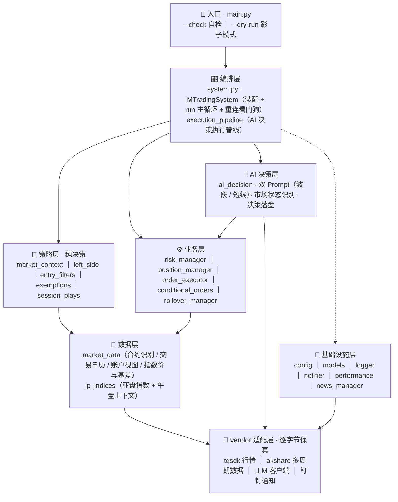

<div align="center">

# 🤖 QuantAI

**LLM 驱动的 IM 标的程序化量化交易系统**

*分层架构 · 多层风控 · Dry-Run 影子模式 · 全链路可观测*


</div>

---

## ✨ 项目简介

QuantAI 是一套以 **IM 交易标的**（中证 1000 指数衍生交易品种）为核心的程序化量化交易系统，覆盖 **数据接入 → 策略决策 → 风控执行 → 持仓管理** 的完整闭环。

系统由一个 5600 余行的单文件原型重构而来：策略层纯决策、业务层构造注入、编排层唯一装配点，依赖方向自上而下、禁止反向；关键行为（含边界路径）均有单元测试锁定。

## 🌟 核心特性

- 🧠 **LLM 双模式决策** — 波段 / 短线双 Prompt 按市场状态自动分派，AI 决策全程 JSONL 落盘可审计
- 🛡️ **多层风控体系** — 熔断器 · 日交易限次 · 风险预算仓位 · 止损冷却 · 应急模式，层层设防
- 📐 **严格分层架构** — 策略层不碰下单、业务层不 import 兄弟模块、编排层依赖注入无全局状态
- 🕵️ **Dry-Run 影子模式** — `DryRunApiProxy` 硬拦截一切下单 / 撤单请求，验收期零真实委托
- 📊 **全链路可观测** — 结构化交易日志 · 绩效统计 · 钉钉实时通知 · AI 决策存档
- 🔬 **高保真工程化** — vendor 适配层逐字节哈希校验，真源行为逐条对齐并测试锁定
- 🧪 **12 步自检** — `--check` 不连网、不下单，逐层验证组件可构造性与核心手算路径

## 🏗️ 系统架构



> 依赖方向自上而下，禁止反向 / 横向依赖；策略层只输出结构化信号与建议，所有下单动作由编排层执行。

## 📦 模块总览

| 层 | 模块 | 职责 |
|:---:|---|---|
| 入口 | `main.py` | CLI：`--check` 12 步自检 / `--dry-run` 影子模式 |
| 编排 | `quantai/system.py` | `IMTradingSystem` 装配 + `run` 主循环 + 重连看门狗 + `DryRunApiProxy` |
| 编排 | `quantai/execution_pipeline.py` | AI 决策 → 风控过滤 → 下单执行管线 |
| AI 决策 | `quantai/ai_decision.py` | 双 Prompt 构建、市场状态识别、信号统计、决策落盘 |
| 策略 | `quantai/strategies/market_context.py` | ATR / 持仓量状态 / 动态位阶 |
| 策略 | `quantai/strategies/left_side.py` | 左侧信号计算 / 渲染 / 告警 |
| 策略 | `quantai/strategies/entry_filters.py` | 入场过滤器（量能 / 趋势共振） |
| 策略 | `quantai/strategies/exemptions.py` | 豁免检查（VCP / VWAP 对齐） |
| 策略 | `quantai/strategies/session_plays.py` | 时段策略（盘前跳空 / 午盘突破 / 尾盘守护） |
| 业务 | `quantai/risk_manager.py` | 熔断器 / 日限次 / 仓位计算 / 止损冷却 / 应急状态 |
| 业务 | `quantai/position_manager.py` | 持仓与条件单状态（带锁 + pkl 持久化 + plain-dict 守护） |
| 业务 | `quantai/order_executor.py` | 安全下单执行（超时 / 拒绝处理） |
| 业务 | `quantai/conditional_orders.py` | 条件单触发检查 |
| 业务 | `quantai/rollover_manager.py` | 主力合约换月 |
| 数据 | `quantai/market_data.py` | 主力合约识别 / 交易日历 / 账户视图 / 指数价与基差 |
| 数据 | `quantai/jp_indices.py` | 亚盘指数快照 + 午盘上下文 |
| 基础设施 | `config` `models` `logger` `notifier` `performance` `news_manager` | 配置 / 数据模型 / 日志 / 钉钉通知 / 绩效 / 财经新闻 |
| 适配 | `quantai/vendor/*` | 行情 / 数据 / LLM / 通知传输层（逐字节保真，禁止修改） |

## 🚀 快速开始

### 1️⃣ 克隆与安装

```bash
git clone git@github.com:Cappuccino-y/QuantAI.git
cd QuantAI
pip install tqsdk akshare pandas numpy requests python-dotenv openai fake_useragent
```

> 要求 **Python 3.10+**

### 2️⃣ 配置账户

```bash
copy .env.example .env     # Windows
# cp .env.example .env     # macOS / Linux
```

编辑 `.env`，填入交易账户信息：

```dotenv
QUANTAI_ACCOUNT=你的账户
QUANTAI_PASSWORD=你的密码
QUANTAI_DRY_RUN=1          # 1 = 影子模式（强烈建议从这里开始）
```

> `.env` 已被 `.gitignore` 排除，账密不会入库。

### 3️⃣ 自检

```bash
python main.py --check
```

12 步自检**不连网、不下单**，逐层验证配置加载、组件可构造性与核心手算路径，全部通过时输出 `自检全部通过 ✅`。

### 4️⃣ 影子运行

```bash
python main.py --dry-run
```

影子模式下 `DryRunApiProxy` 拦截所有下单 / 撤单请求（仅放行只读行情与账户查询），可安全观察系统完整决策循环。

## 📁 目录结构

```text
QuantAI/
├── main.py                    # CLI 入口：--check 自检 / --dry-run 影子模式
├── .env.example               # 环境配置模板
├── docs/
│   └── ARCHITECTURE.md        # 架构设计与关键决策记录
├── quantai/
│   ├── config.py              # .env 配置加载
│   ├── models.py              # 数据模型（Position / AIDecision / ConditionalOrder ...）
│   ├── logger.py              # 交易日志
│   ├── notifier.py            # 钉钉通知
│   ├── performance.py         # 绩效统计
│   ├── news_manager.py        # 财经新闻管理
│   ├── market_data.py         # 数据层：合约 / 日历 / 账户 / 指数价
│   ├── jp_indices.py          # 亚盘指数 + 午盘上下文
│   ├── strategies/            # 策略层（纯决策）
│   │   ├── indicators.py      #   ATR 等指标纯函数
│   │   ├── market_context.py  #   市场语境（ATR / 持仓量 / 动态位阶）
│   │   ├── left_side.py       #   左侧信号
│   │   ├── entry_filters.py   #   入场过滤器
│   │   ├── exemptions.py      #   豁免检查
│   │   └── session_plays.py   #   时段策略
│   ├── risk_manager.py        # 熔断 / 限次 / 仓位 / 冷却
│   ├── position_manager.py    # 持仓状态（带锁持久化）
│   ├── order_executor.py      # 安全下单
│   ├── conditional_orders.py  # 条件单
│   ├── rollover_manager.py    # 主力合约换月
│   ├── execution_pipeline.py  # 决策执行管线
│   ├── ai_decision.py         # AI 决策（双 Prompt）
│   ├── system.py              # IMTradingSystem 编排 + 主循环
│   └── vendor/                # 适配层（逐字节保真，禁止修改）
└── tests/                     # 单元测试套件
```

## 🗺️ 开发进度

| 阶段 | 里程碑 | 主要内容 | 状态 |
|:---:|---|---|:---:|
| 1 | 骨架期 | 包结构 + 基础设施 + vendor 保真迁移 | ✅ |
| 2 | 数据层 | 行情服务 · 交易日历 · 账户视图 · 亚盘指数 | ✅ |
| 3 | 策略层 | 市场语境 · 左侧信号 · 入场过滤 · 豁免 · 时段策略 | ✅ |
| 4 | 业务层 | 风控 · 持仓 · 下单 · 条件单 · 换月 · 执行管线 | ✅ |
| 5 | 编排期 | 系统装配 · run 主循环 · AI 决策接线 | 🚧 |
| 6 | 验收期 | 影子运行 ≥ 3 交易日 · 稀有路径历史回放对拍 | ⬜ |

## 📚 文档

- [docs/ARCHITECTURE.md](docs/ARCHITECTURE.md) — 依赖方向、vendor 保真策略、各阶段关键决策记录

## ⚠️ 风险提示

> 本项目用于量化交易技术研究与学习交流，**不构成任何投资建议**。程序化交易存在包括但不限于行情异常、网络中断、策略失效、系统故障等风险，实际交易可能造成本金损失。请在充分理解相关风险并遵守所在地区法律法规的前提下谨慎使用；交易决策与盈亏由使用者自行承担。
